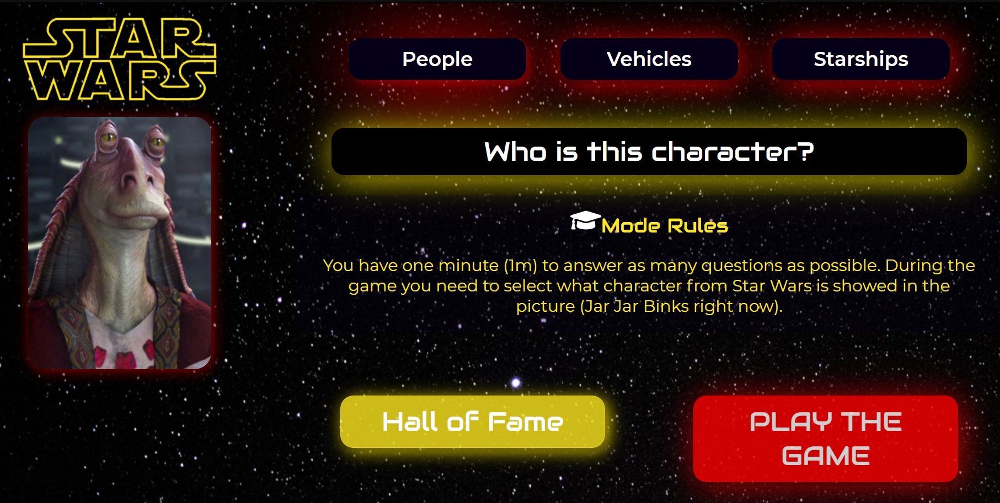
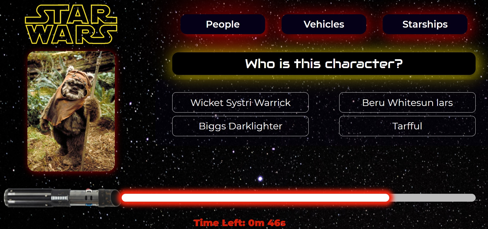
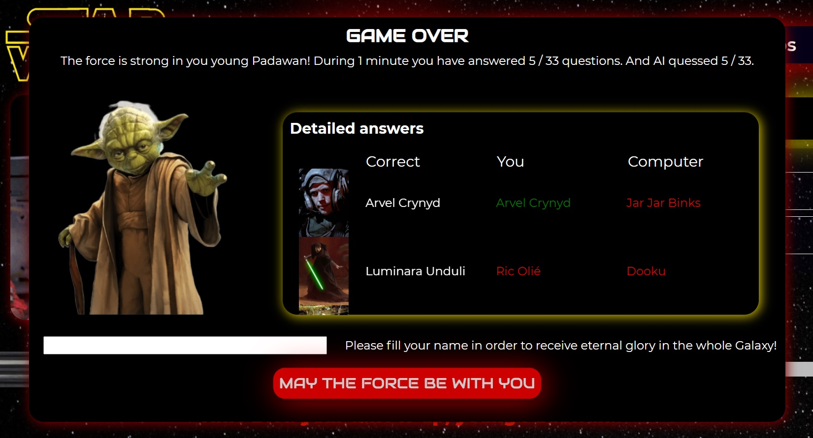
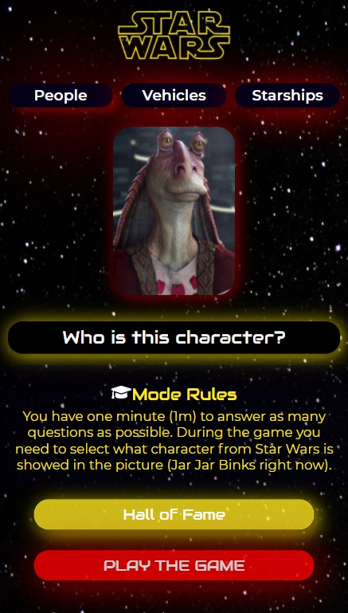

# STAR WARS QUIZ #CODERSCAMP2020

The aim of the project was to create a Star Wars Quiz based on the recommendations from the #CodersCamp2020 JavaScript Project (https://github.com/CodersCamp2020/CodersCamp2020.Project.JavaScript.StarWarsQuiz). The project was an opportunity to memorize and practise JavaScript skills learned during programming course organized by CodersCrew.

During the game you have exactly 1 minute to answer as many questions as possible. Your task is to select what character /vehicle or starship from Star Wars is showed in the picture. The computer will be your rival. 

#####  Demo: https://piotr-bocian.github.io/Projekt-2-quiz/

# Technologies:

  - HTML, CSS;
  - JavaScript;
  - no React, Angular or style library was used for implementation!

# Project's desing & layout:
The design has been improved in relation to the suggested application appearance, as shown in the photos below:
#####  Landing Page: 
#####  Game on: 
#####  Results: 
#####  Mobile support: 

# Other informations:
Team Lead: Piotr Bocian
Team Members: Jan Eliasz, Adam Połynka, Szymon Suchodolski, Daria Torz, Klaudia Wojciechowska, Łukasz Żurawski.

Launch date: 18/01/2020

